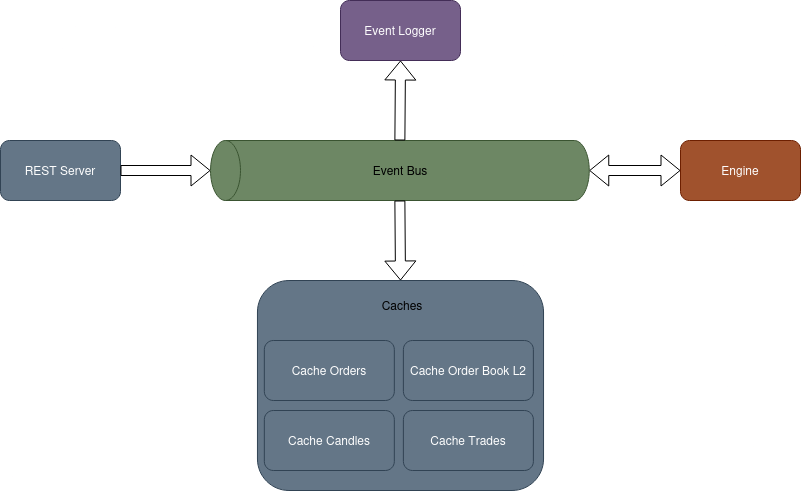

# Simple Digital Exchange
This project is a simple digital asset exchange system that allows users to place orders, view live order book data, past trades, and candle data

## Server Side
Written in C++.

### Features
- __REST API:__ Allows interaction with the exchange, including order placement, retrieving the order book, trades, and candles.
- __Matching Engine:__ Matches buy and sell orders based on price and time priority.
- __Event Bus:__ Manages asynchronous communication between components using an event-driven model.
- __Event Logger:__ Logs all events transmitted through the event bus for debugging and auditing purposes.
- __Caches:__
  - __Orders:__ Stores active buy and sell orders.
  - __Order Book:__ Stores the current state of the order book (Layer 2).
  - __Candles:__ Stores historical data for price candles.
  - __Trades:__ Stores information on completed trades.

## Dependencies
[httplib](https://github.com/yhirose/cpp-httplib): Header-only HTTP library for building the REST API.

[nlohmann json](https://github.com/nlohmann/json): For JSON parsing and serialization.

### Architecture

## UI
A lightweight frontend written in Python using the DearPyGui library. It wraps the REST API and showcases basic functionality of the exchange.

### Features
- __Order Placement:__ Allows users to place buy and sell orders through a simple interface.
- __Info Retrieval:__ Displays real-time data such as the order book, past trades, and price candles.
- __REST API Wrapper:__ A Python wrapper around the server's REST API to communicate with the backend.

## Dependencies
[DearPyGui](https://github.com/hoffstadt/DearPyGui): A fast, simple-to-use GUI framework for Python.

### UI Showcase

